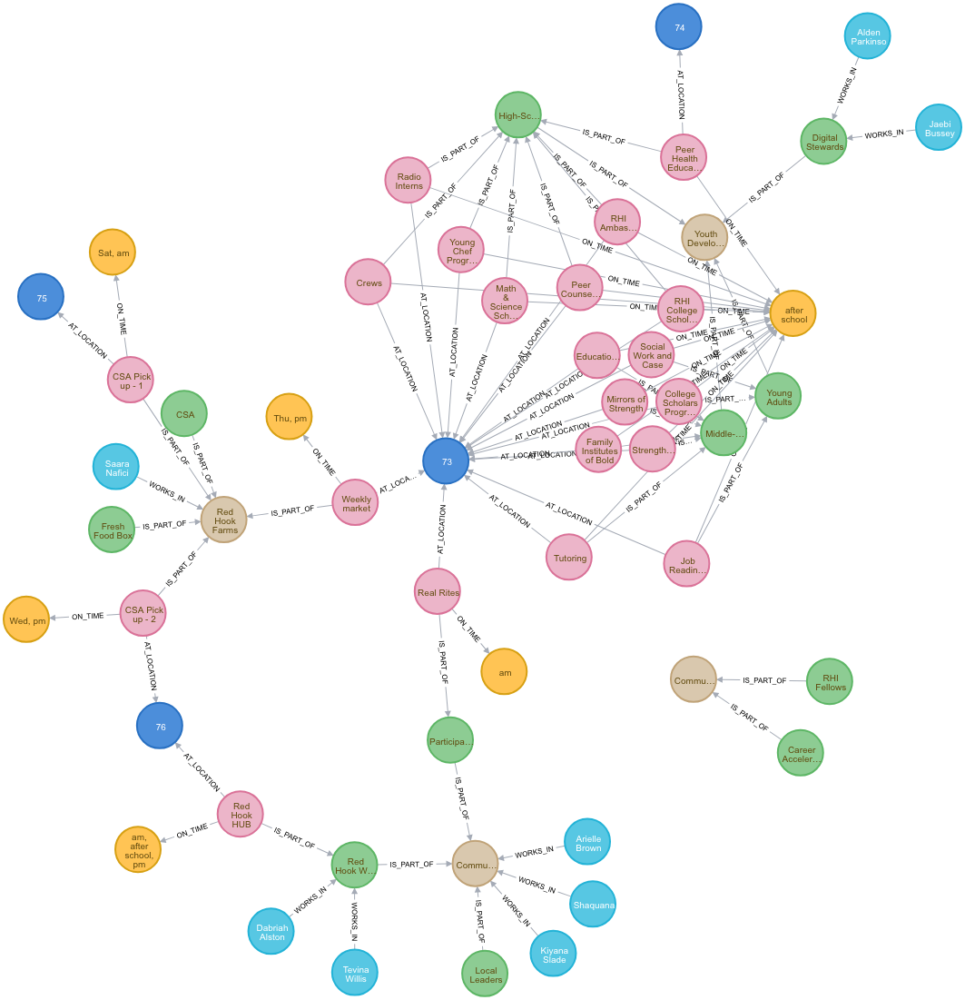

# RHI_analysis
A network analysis using Ipython, py2neo and neo4j for a community organization at Red Hook, Brooklyn, in order to better understand different programs, cross-collaborations and effectiveness. 

